<h1 align="center">COURSE MANAGEMENT SYSTEM</h1>

This repository contains source code of Course Management System.

## Features
- User Authentication.
- Create classes.
- Join classes.
- Post assignments/materials.
- Grade distribution.
- Mobile responsive.

## Screenshots
Login screen

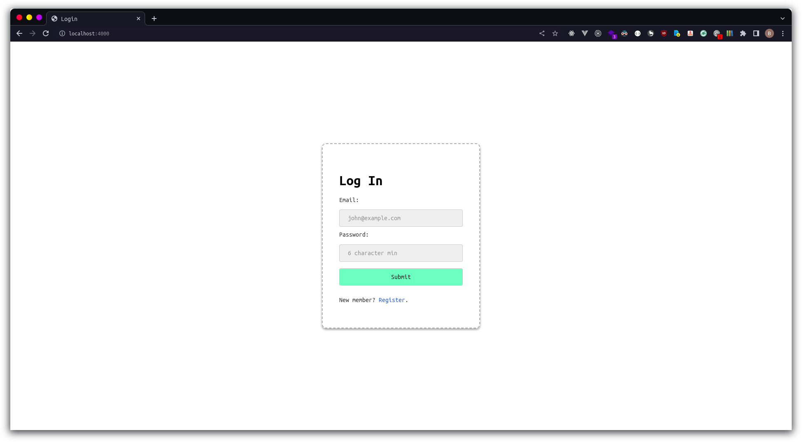

Register screen
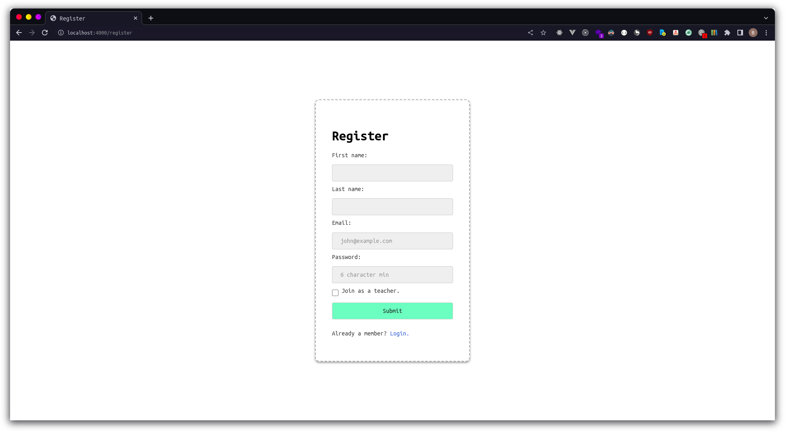
Create class
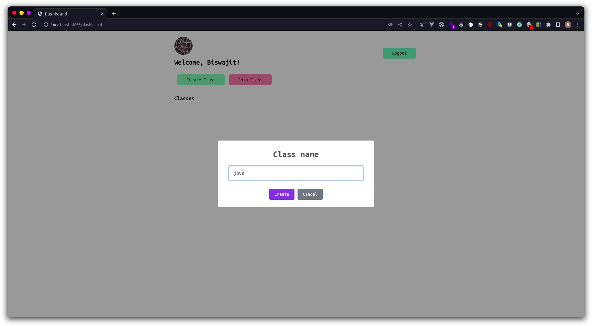
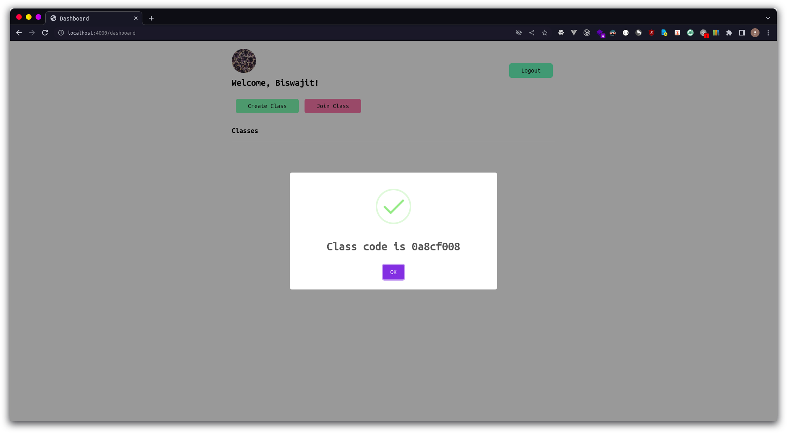
Join class
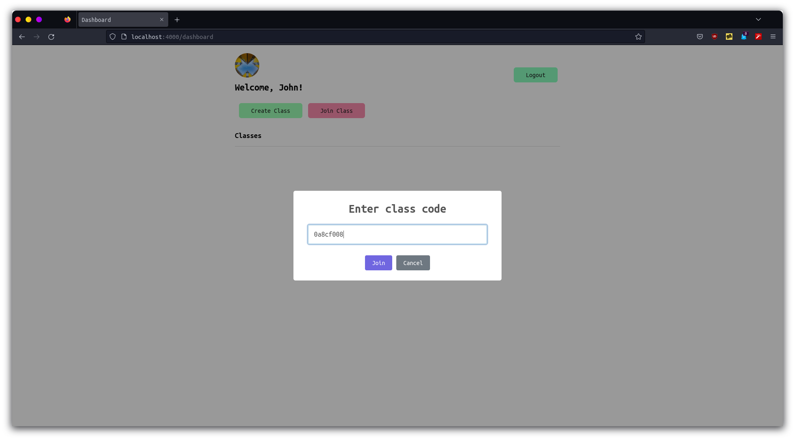
Dashboard
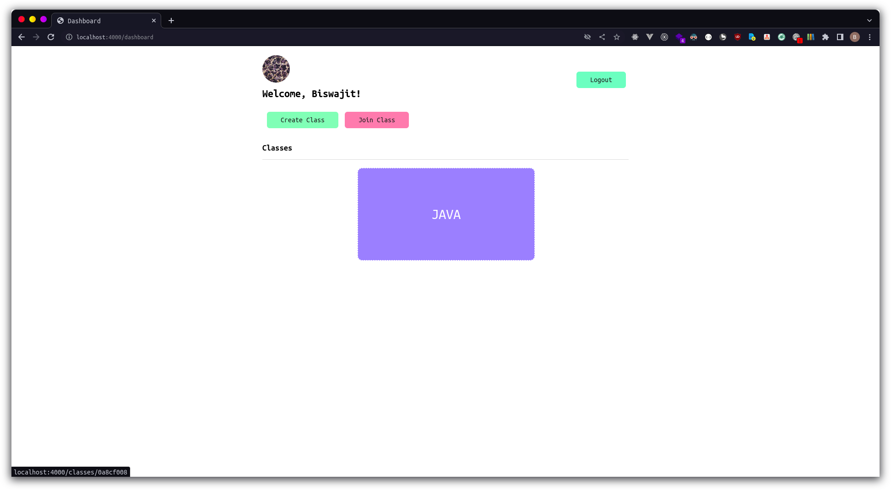
Post assignment
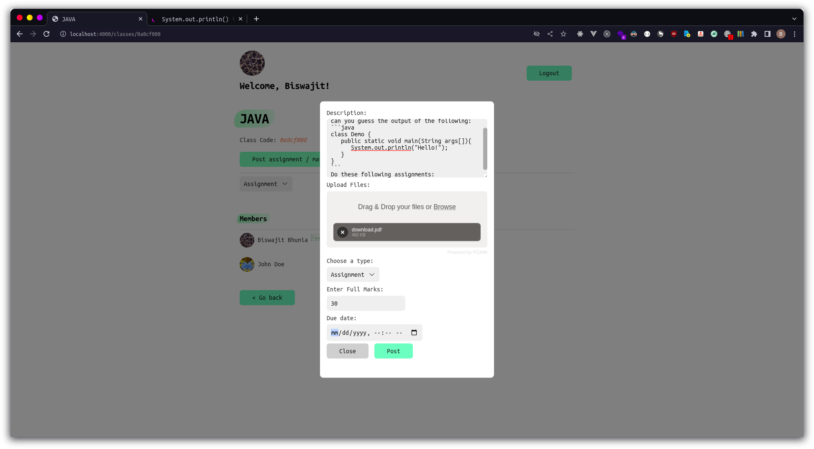
All assignments
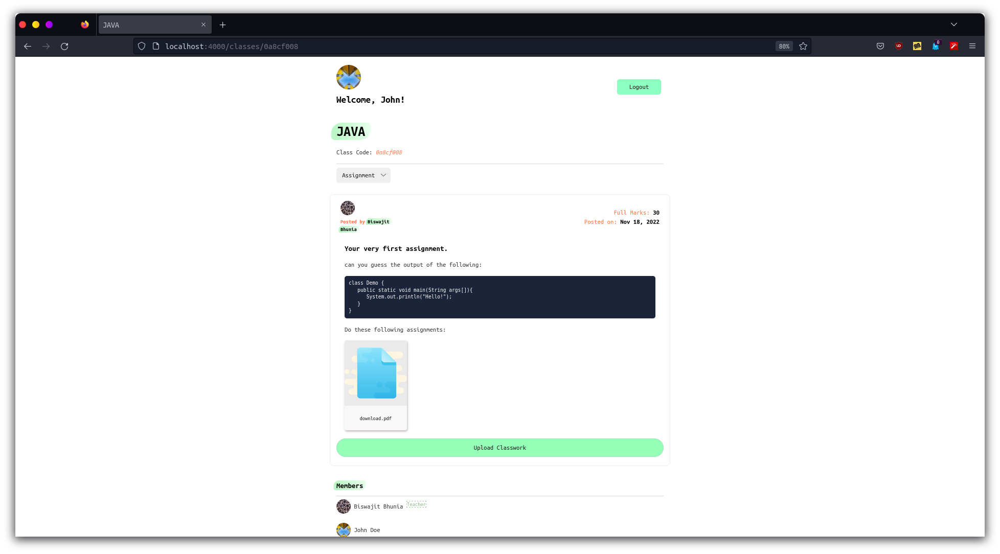
Upload Classwork
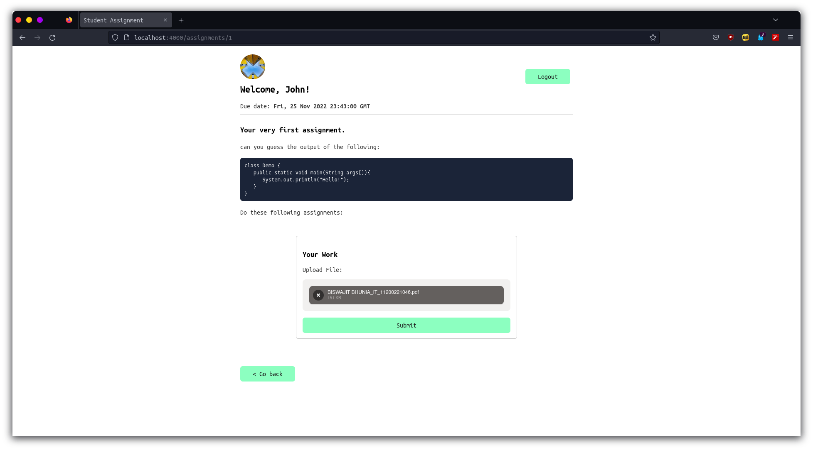
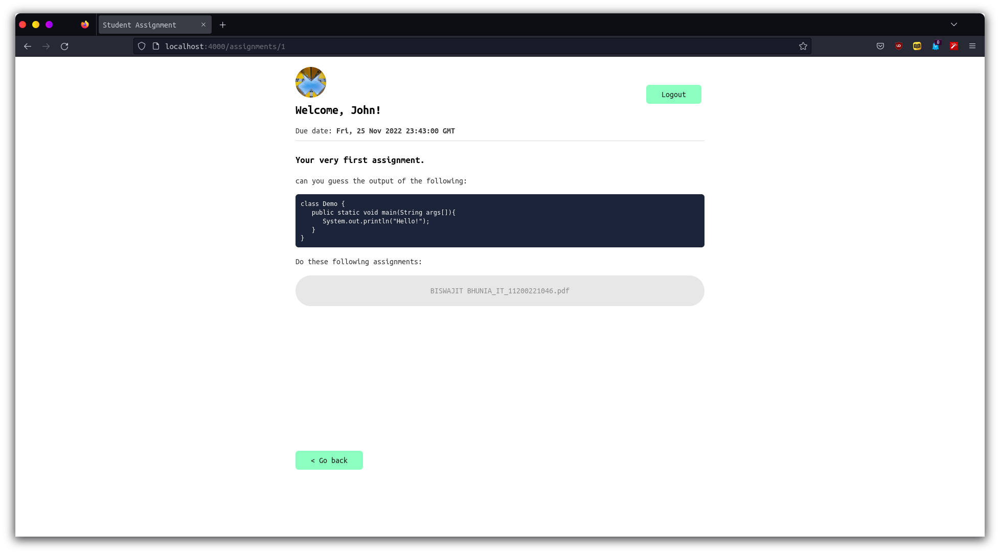

Upload marks
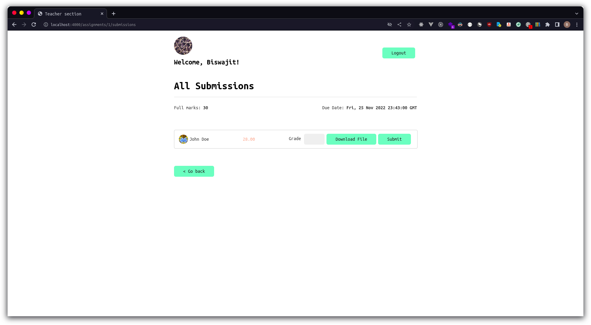

Obtained marks
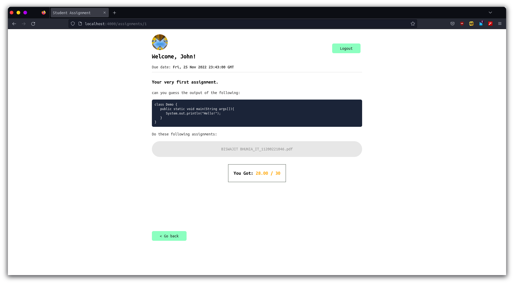